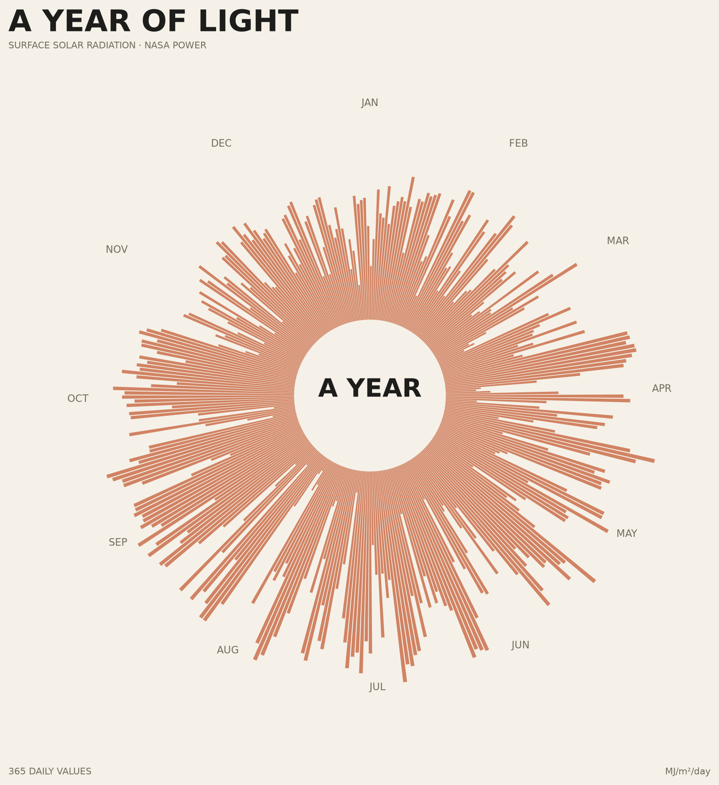

# A Year of Light

## The phenomenon

Solar radiation reaching the Earth's surface changes from day to day and across the year. I chose this phenomenon because sunlight is usually experienced as something continuous and atmospheric, while the data describes it as a sequence of numerical measurements. I wanted to turn that sequence into a visual object representing one complete year.

## The source

The data comes from NASA POWER's Daily API:

https://power.larc.nasa.gov/docs/services/api/temporal/daily/

I requested `ALLSKY_SFC_SW_DWN` for Hong Kong (22.3193 N, 114.1694 E) from 1 January to 31 December 2025. The dataset contains one daily value for surface shortwave downward solar radiation, reported in MJ/m²/day.

## What the picture shows

Each day becomes one position around a circle, so the full circle represents one year. The length of each radial mark is determined by that day's solar radiation value. Longer marks represent days receiving more surface solar radiation, allowing the seasonal rhythm of sunlight to become visible as a continuous annual form.

The circular transformation makes the seasonal pattern easier to see, but it hides the exact chronological distance between neighbouring days and makes individual numerical values harder to read than a conventional line chart. It also represents daily totals rather than the changes within each day.

## Run it

uv run fetch.py
uv run plot.py